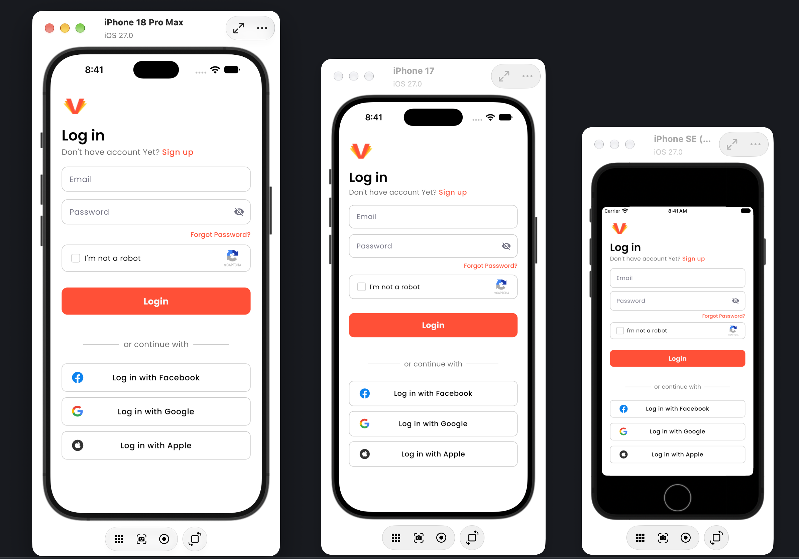
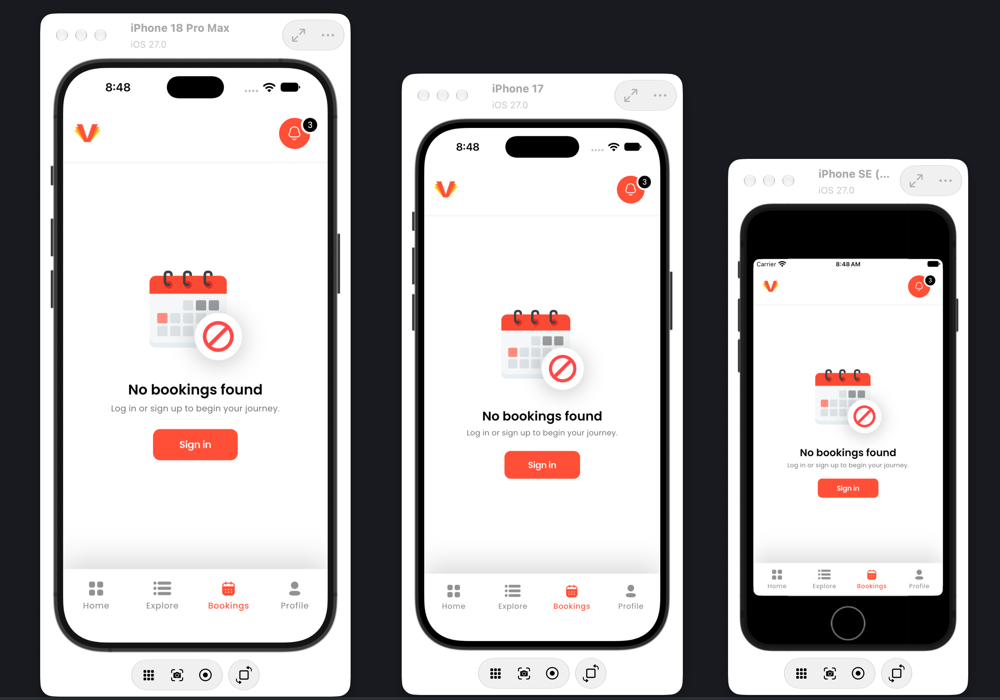

<<<<<<< HEAD


https://github.com/user-attachments/assets/84cc0ee2-0d0e-4b7d-9947-5292dc51be22

# venuze_app
=======
# Venuze
>>>>>>> ccc64e5 (updated readme and constants)

A Flutter implementation of the Venuze login and bookings screens, built from
a Figma design and integrated with the Venuze login API.

**Repository:** https://github.com/FahadMehmood056/Venuze-App
**Download APK:** [app-release.apk](https://github.com/FahadMehmood056/Venuze-App/releases/download/v1.0.0/app-release.apk)

---

## Screenshots

### Login



### Bookings



Both screens were tested on multiple mobile devices.

Responsiveness is handled in four ways rather than by scaling alone:

- **`flutter_screenutil`** scales spacing, sizes and font sizes proportionally
  from the 375 x 812 Figma frame, so the layout keeps the design's proportions
  on any screen. Raw Figma values live in `AppSizes` and `.w` / `.h` / `.r` are
  applied at the point of use, so the source of each number stays visible.
- **`Expanded` and `Flexible`** are used wherever content should share the
  available width instead of taking a fixed size: the dividers either side of
  "or continue with", the labels in the social buttons, and the four items in
  the bottom navigation bar.
- **`SingleChildScrollView`** wraps the login form, so the screen scrolls
  rather than overflowing when the keyboard opens on a small device.
- **`SafeArea` and `MediaQuery.paddingOf`** keep content clear of the notch and
  the home indicator, and extend the bottom navigation bar's height by the
  device's bottom inset.

---

## Demo

https://github.com/user-attachments/assets/84cc0ee2-0d0e-4b7d-9947-5292dc51be22

The video shows login, the loading state, the error message for wrong
credentials, and the session being restored on a cold start.

---

## Running the project

```bash
git clone https://github.com/FahadMehmood056/Venuze-App.git
cd Venuze-App
flutter pub get
dart run build_runner build --delete-conflicting-outputs
flutter run
```

The `build_runner` step is required. It generates `lib/core/gen/assets.gen.dart`
and `fonts.gen.dart`, and the project will not compile without them.

Requires Flutter with Dart SDK `^3.12.0`.

### Test credentials

```
Email:    fiju705@gmail.com
Password: 12345678
```

> **Note on the credentials in the task document.** The document lists the email
> as `fiju705+premier@gmail.com`. That address returns
> `403 Incorrect email or password` from the API. Removing the `+premier` part
> logs in successfully, so the address above is the one used throughout.

---

## Tech stack

| Package                  | Why                                                                      |
| ------------------------ | ------------------------------------------------------------------------ |
| `get`                    | State management, dependency injection and routing                       |
| `dio`                    | HTTP client, used here with `FormData` since the API expects form fields |
| `dartz`                  | `Either<Failure, T>` so error cases are part of the return type          |
| `flutter_secure_storage` | Persisting the session tokens                                            |
| `flutter_screenutil`     | Proportional scaling from the Figma frame                                |
| `flutter_svg`            | Icon rendering                                                           |
| `flutter_gen`            | Type-safe asset and font references                                      |

State management is GetX, as confirmed before starting.

---

## Architecture

Clean Architecture with three layers per feature. Dependencies point inward:
the presentation layer knows about the domain, the data layer implements the
domain's interfaces, and the domain knows about neither.

**Flow of a login request:**

```
LoginPage → LoginController → LoginUseCase → AuthRepository (interface)
                                                    ↓
                                          AuthRepositoryImpl
                                                    ↓
                              AuthRemoteDataSource → Venuze API
                              AuthSecureLocalDataSource → secure storage
```

**Domain** holds entities, repository interfaces and use cases. It has no
Flutter or Dio imports, so it could be unit tested without a widget tree.

**Data** holds models with `fromJson` / `toJson` / `toEntity`, the remote and
local data sources, and the repository implementation. Models are separate
classes from entities rather than subclasses, so serialisation stays out of
the domain.

**Presentation** holds pages, widgets, GetX controllers and bindings.

### Folder structure

```
lib/
├── app.dart
├── main.dart
├── core/
│   ├── bindings/          app-wide dependency registration
│   ├── constants/         api, sizes, strings, storage keys
│   ├── errors/            Failure, ApiException, StorageException
│   ├── gen/               generated assets and fonts
│   ├── models/            shared models (NavItem)
│   ├── network/           Dio client and error mapper
│   ├── routes/            route names and GetPage list
│   ├── theme/             colours, text theme, ThemeData
│   ├── utils/             snackbar, failure messages, JSON reader
│   ├── validators/        form validation
│   └── widgets/           AppButton, AppTextField, AppBottomNav, ...
└── features/
    ├── auth/
    │   ├── data/          datasources, models, repository impl
    │   ├── domain/        entities, repository interface, use cases
    │   └── presentation/  bindings, controllers, pages, widgets
    ├── bookings/
    │   └── presentation/
    └── main/
        └── presentation/  bottom navigation shell
```

### Dependency injection

`InitialBinding` registers the long-lived dependencies at startup: the Dio
client, secure storage, both data sources, the repository, both use cases and
the session controller. `LoginBinding` is attached to the login route and
creates `LoginController` lazily, so it is disposed when the route is left.

---

## Error handling

Errors are typed and never surface as raw exceptions in the UI.

1. **Data source** throws `ApiException` when the API returns
   `success: false`, or `StorageException` when secure storage fails.
2. **Repository** catches `DioException`, `ApiException`, `StorageException`
   and `FormatException`, and returns `Left(Failure)`.
3. **`ApiErrorMapper`** classifies the failure from the status code:
   timeouts, no connection, 401/403 as authentication, 422 as validation,
   5xx as server, and everything else as a request error. A `2xx` response
   carrying `success: false` is treated as an authentication failure, which is
   how this API rejects bad credentials.
4. **`FailureMessage`** resolves a `Failure` to a user-facing string. It
   prefers the message the server sent, so a rejected login shows the API's own
   wording, and falls back to a local string for failures that never reached
   the server.
5. **Controller** stores the `Failure`, and the page shows it in a snackbar.

Parsing is also defensive: `JsonReader` validates each field's type and throws
a `FormatException` on a malformed response, which becomes
`FailureType.parsing` rather than a crash.

---

## Session handling

On successful login the session (tokens plus user) is written to
`flutter_secure_storage`. On startup `main.dart` calls `RestoreSessionUseCase`,
which reads the stored session and checks the access token's expiry. If it is
still valid the app opens directly on the bookings screen; otherwise the stored
session is cleared and the app opens on login.

---

## Implemented

- Login screen built to the Figma design
- Email and password validation with inline field errors
- Loading state on the login button, with the button disabled during the request
- Error messages from the API shown in a snackbar
- Session persisted in secure storage and restored on a cold start
- Bookings screen with the empty state and the bottom navigation bar
- Responsive layout verified on three device sizes

---

## Decisions and assumptions

**Font.** The Figma file used both Poppins and Inter across the two screens,
including on equivalent buttons. Poppins was used throughout, keeping the size
and weight differences from the design.

**Password visibility toggle.** Not in the design, but added, since a password
field with no way to reveal the input is a usability gap.

**reCAPTCHA.** Implemented as a functional checkbox that gates the login
button, but it performs no verification, as no reCAPTCHA site key was provided.

**Social login.** The Facebook, Google and Apple buttons are UI only. Real
social sign-in needs OAuth client IDs and platform configuration that were not
part of the task.

**Sign up and forgot password.** UI only, since no endpoints or designs were
provided for them.

**User model.** The login response returns a large user object, including role
permissions and a profile. All of it is modelled, so the session carries
everything the API returns rather than a subset.

**Token refresh.** The login response includes a refresh token and its expiry,
and both are stored, but no refresh endpoint was provided. `restoreSession()`
already checks access-token expiry, so this is the one place a refresh call
would be added.

**Logout.** No logout endpoint was provided, and the design has no logout
control. Clearing the stored session locally is supported by
`AuthLocalDataSource.clearSession()`.

**Home, Explore and Profile tabs.** No designs or endpoints were provided, so
these tabs are present in the navigation bar but empty.
